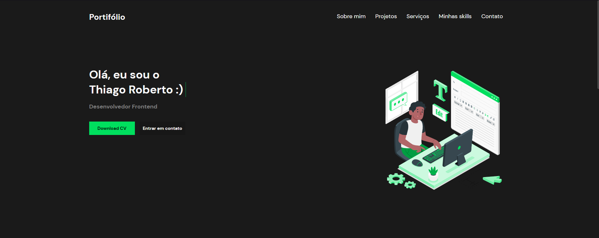

# Portfólio

O objetivo do projeto é desmonstrar na prática minhas habilidades como desenvolvedor Front end e UI/UX, além de contar um pouco mais cobre mim, demonstrar outros projetos que desenvolvi e opções de contato.

# O que eu usei?:

<ul>
<li>React</li>
<li>React Hooks</li>
<li>Figma</li>
</ul>


# Demo 📸

<h1 align="center">
    
</h1>

# Acessar online
https://thi-portifolio.netlify.app

# Pré requisitos

Você deve ter essas ferramentas instaladas na sua máquina : Git, Node.js e Yarn ou Npm.

# Rodando o App

1.Clone o projeto

```bash
# Execute esse comando utilizando git bash
$ git clone https://github.com/Thialves02/portifolio-react
```

2.Entre na pasta clonada e execute os seguintes comandos

```bash
# Instalar as dependências
$ yarn install
$ npm install
```

3.Rode a aplicação
```bash
#Abra o app no seu navegador
$ yarn start
$ npm start
```
